## 💛 SSG.COM CLONE PJT BY HOT

---

### **SSG.COM 클론 프로젝트 (신세계몰)**

<p align="center">
  
</p>

### 목표

- 서비스분석을 바탕으로 쇼핑몰 클론코딩 프로젝트 수행 능력 향상
- 팀 프로젝트를 수행하며, SW 개발 뿐만 아니라 팀원들과 함께 문제를 해결하기 위한 협업 역량을 배양
  </br></br>

### 프로젝트

- 2022.07.25 ~ 2022.09.08(35일/280시간)
- [Github](https://github.com/spharosacademy-HOT)
- [Notion](https://www.notion.so/e366ed0214f745b29d128555d5592a42)
  </br></br>

### **_📌_** 차례

---

1. [서비스 소개](#🎞-서비스-소개)
2. [주요 기술 스택](#***⚙***-주요-기술-스택)
3. [아키텍쳐](#***🔨***-아키텍쳐)
4. [ER Diagram](#***🔗***-ER-Diagram)
5. [Git Branch](#***🌿***-Git-Branch)
6. [Commit 규칙](#✔-Commit-규칙)
7. [시작하기](#✔-시작하기)
8. [팀원소개](#🍩-강알리-등킨드나쓰-팀원)

<br/>

### 🎞 서비스 소개

---

### Auth

---

## 로그인페이지

</br>

<p align="center">
  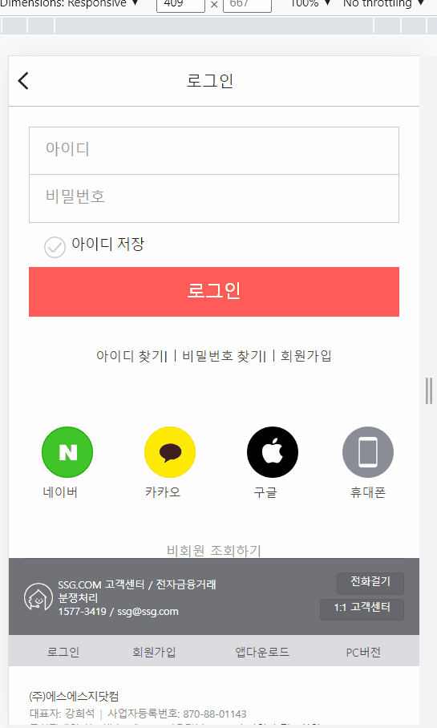
</p>

</br>

### 1. 로그인 페이지에서는 일반 로그인 및 소셜 로그인(네이버, 카카오, 구글)을 할 수 있다.

### 2. 아이디와 비밀번호를 입력받아 올바른 데이터인지 확인 후 알럿을 통해 성공/실패를 알려준다.

</br></br>

## 회원가입페이지

</br>

<p align="center">
  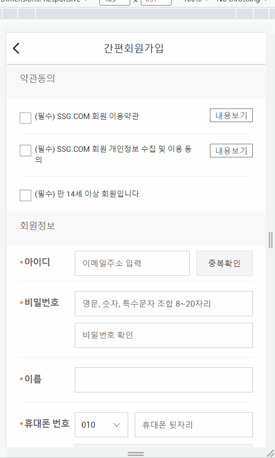
</p>
</br>
<p align="center">
  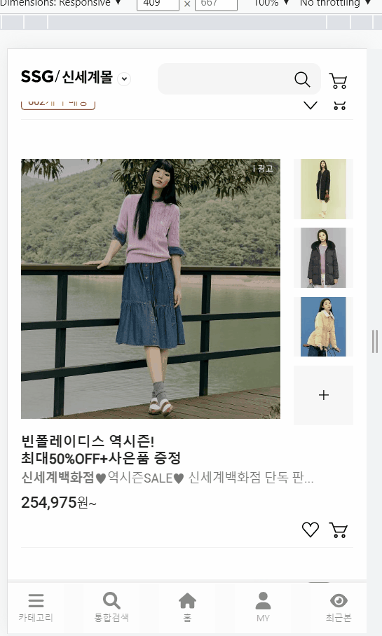
</p>
</br>

### 1. 사용자에게 입력 데이터를 받아 회원가입을 할 수 있다.

### 2. 이메일, 비밀번호, 휴대폰 데이터를 유효성 검사를 통하여 올바른 양식인지 확인할 수 있다.

### 3. 이메일은 중복 검사한다.

### 4. 휴대폰 문자 인증번호 확인을 하여 등록할 수 있다.

### 5. 버튼 색깔과 클릭 가능 여부를 통해 사용자에게 편의 UI를 제공한다.

</br></br>

### 상품

---

</br>

## 카테고리 페이지

</br>

<p align="center">
  
</p>

</br>

### 1. 이미지를 통해서 대분류 카테고리를 확인할 수 있다.

### 2. 대분류 선택시 하단에 중분류 카테고리를 확인할 수 있다.

### 3. 선택한 카테고리의 아이템 목록을 카드형식으로 확인할 수 있다.

### 4. 아이템의 이름, 가격, 이미지 등을 미리 확인할 수 있다.

### 5. 좋아요 버튼을 통해 찜 관리를 할 수 있다.

</br></br>

## 상품 디테일 페이지

</br>

<p align="center">
  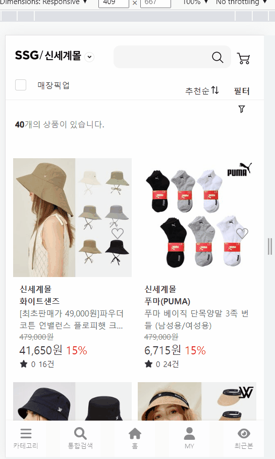
</p>

</br>
<p align="center">
  
</p>

</br>

### 1. 상품에 대한 디테일 정보를 확인할 수 있다.

### 2. 상품에 대해 문의를 작성하고 조회할 수 있다.

### 3. 좋아요 버튼을 통해 찜 관리를 할 수 있다.

### 4. 옵션을 선택할 수 있다.

### 5. 바로주문을 할 수 있다.

### 6. 장바구니에 상품을 담을 수 있다.

</br></br>

### 장바구니

---

## 장바구니페이지

</br>

<p align="center">
  
</p>

</br>

### 1. 장바구니에 담은 아이템 목록을 확인 할 수 있다.

### 2. 아이템 수량을 변경할 수 있다.

### 3. 아이템 옵션 변경할 수 있다.

### 4. 나의 배송지를 확인할 수 있다.

### 5. 장바구니가 없을 시 인기상품 등의 데이터를 확인할 수 있다.

### 6. 여러개 상품을 선택하여 한번에 주문할 수 있다.

### 7. 낱개 상품은 바로구매할 수 있다.

</br></br>

### 주문

---

## 주문페이지

</br>

<p align="center">
  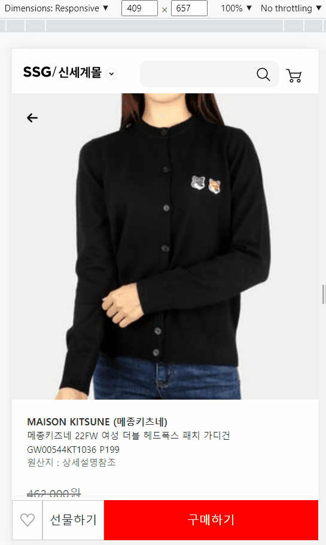
</p>

</br>

### 1. 주문에 필요한 전반적인 정보를 확인할 수 있다.

### 2. 결제방법을 선택할 수 있다.

### 3. 배송지를 변경할 수 있다.

### 4. 배송 요청사항을 선택할 수 있다.

### 5. 결제 완료 후 주문완료 페이지를 보여준다.

</br></br>

### 유저

---

</br>

## 마이페이지

</br>

<p align="center">
  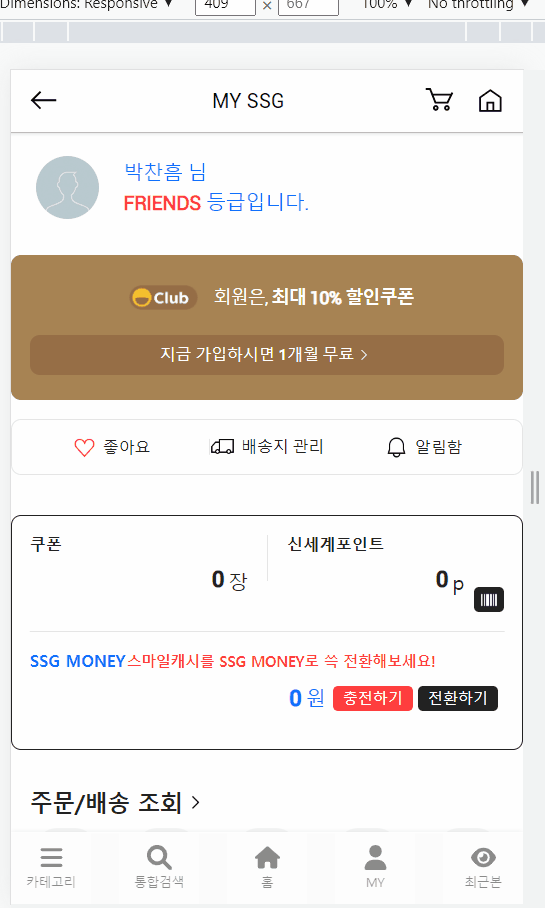
</p>

</br>
<p align="center">
  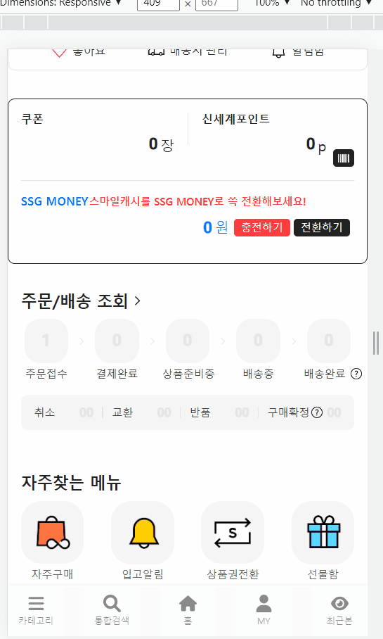
</p>

</br>

### 1. 배송지 관리할 수 있다.

### 2. 좋아요 리스트를 확인할 수 있다.

### 3. 주문 조회할 수 있다.

</br></br>

## 주소관리페이지

</br>

<p align="center">
  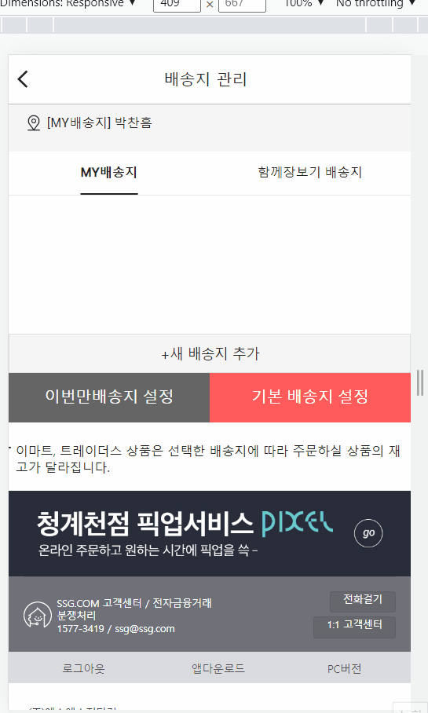
</p>
</br>
<p align="center">
  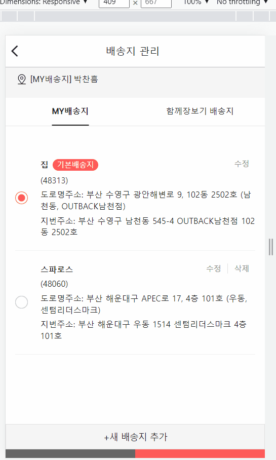
</p>
</br>

### 1. 배송지를 추가, 수정, 삭제할 수 있다.

### 2. 기본배송지를 변경할 수 있다.

### 3.다음 우편번호 API를 통해서 주소를 입력받을 수 있다.

</br></br>

### 검색

---

## 검색페이지

</br>

<p align="center">
  
</p>

</br>

### 1. 최근 검색 기록들을 볼 수 있다.

### 2. 검색 기록을 선택 시 해당 검색결과페이지를 보여준다.

### 3. 검색어를 입력하면 검색 결과페이지를 보여준다.

### 4. 검색결과페이지에서 상품목록을 필터링할 수 있다.

</br></br>

### 최근

---

## 최근본페이지

</br>

<p align="center">
  
</p>

</br>

### 1. 최근 본 상품을 볼 수 있다.

### 2. 최근 본 상품을 좋아요 관리를 할 수 있다.

### 3. 최근 본 상품을 장바구니에 넣을 수 있다.

### 4. 검색어 버튼을 누르면 최근 검색어 목록을 볼 수 있다.

</br></br>

### **_⚙_** 주요 기술 스택

---


## 1. 주요 버전

```cmd
1. JVM : 1.8.0_192
2. Web Server : Nginx 1.23.1
3. WAS : Tomcat 9.0.65
4. Visual Studio : 1.71.0
5. IntelliJ : IntelliJ IDEA 2021.3.2 (community)
6. React : 18.2.0
7. NodeJS : 16.16.0
8. springBootVer : '2.7.2'
9. Docker : 20.10.17
10. 기타 상세 버전 정보
    - React : package.json
    - SpringBoot : build.gradle
```

<br/>

### **_🔨_** 아키텍쳐

---

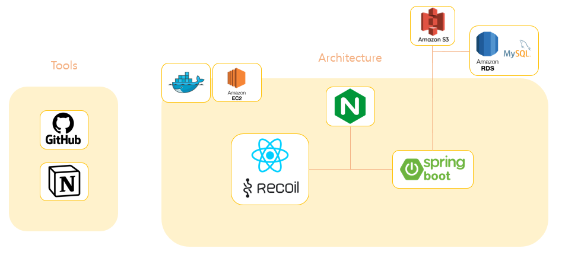

<br/>

### **_🔗_** ER Diagram

---

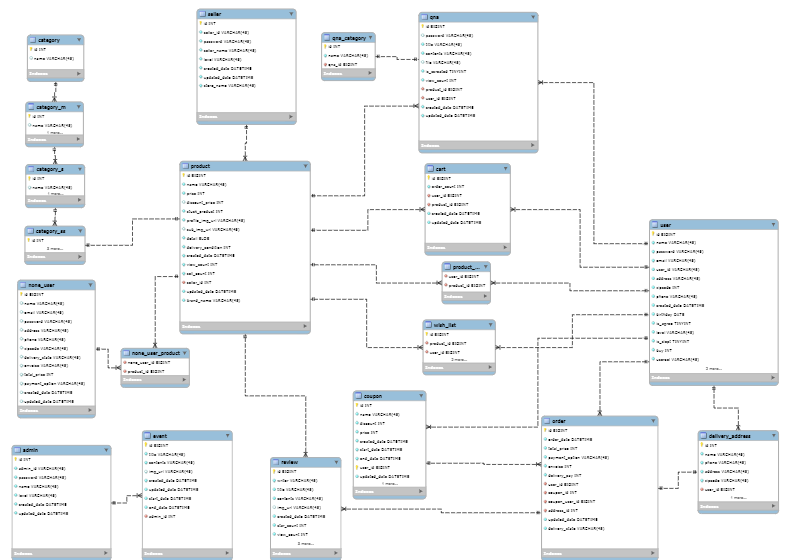

<br/>

### **_🌿_** Git Branch

---

> ✨ (main) → (backend / frontend) → (feature/<BE / FE>/<feature>)

- `main` : release branch

- `backend` : backend branch

- `frontend` : frontend branch

- `feature/<BE/FE>/<feature>` : 개별 개발 branch

<br/>

### ✔ Commit 규칙

---

> ✨ 형태 : git commit -m '#[깃이슈번호] [git 컨벤션]: [작업내용]'
>
> 예시 ) `git commit -m '#[깃이슈번호] feat 페이지네이션 기능 추가'`

- git commit -m '#[깃이슈번호] style: 버튼 스타일링'

- git commit -m '#[깃이슈번호] fix: 팝업 버그 수정'

- git commit -m '#[깃이슈번호] docs: 리드미 수정'

<br/>

> **Git 컨벤션**

- feat : 새로운 기능
- fix : 버그 수정
- docs : 문서 (문서 추가, 수정, 삭제)
- style : 포맷팅, 세미콜론 추가, etc) 코드 변화 없을 때
- refactor : 코드 리팩토링
- test : 테스트 추가, 테스트 리팩토링
- chore: 빌드 업무 수정, 패키지 매니지 수정

<br/>

### ✔ 시작하기

---

#### 시작하기

---

```shell
# /backend/
$ gradlew clean build
$ build/libs/ssg-0.0.1-SNAPSHOT.jar -jar app.jar

# /frontend/
$ npm install
$ npm start
```

### 🔥 HOT 팀원

---

- **박찬흠** \- _backend -_ [fineman999](https://github.com/fineman999)
  - [33cks1423@naver.com](mailto:33cks1423@naver.com)
- **박수아** \- _frontend -_ [pakrsua](https://github.com/pakrsua)
  - [tndk4997@naver.com](mailto:tndk4997@naver.com)
- **양진기** \- _backend -_ [82User](https://github.com/82User)
  - [zxcvc9999@gmail.com](mailto:zxcvc9999@gmail.com)
- **이창현** \- _frontend -_ [ckdtns5262](https://github.com/ckdtns5262)
  - [ckdgus5262@gmail.com](mailto:ckdgus5262@gmail.com)
- **전호정** \- _frontend -_ [hoho](https://github.com/hojeong33)
  - [jhj20071@gmail.com](mailto:jhj20071@gmail.com)
